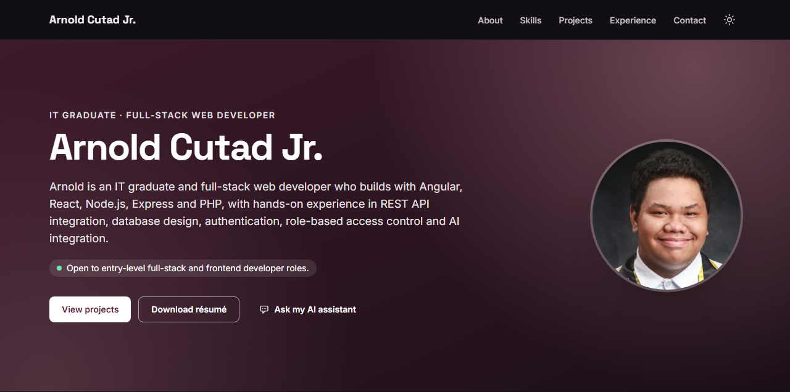
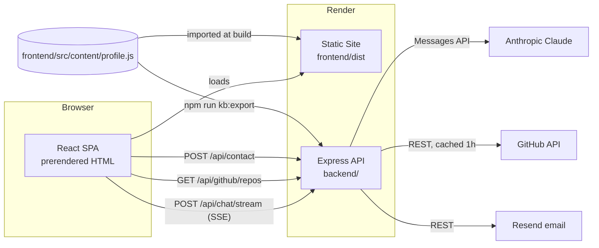

# Arnold Cutad Jr. – Portfolio

Personal portfolio of **Arnold Cutad Jr.**, IT graduate and full-stack web developer (Cebu, Philippines),
with an AI assistant that answers visitors' questions about his work.



<!-- Live site: add the URL here once deployed (and set VITE_SITE_URL, see below). -->

## Features

- **Sections:** sticky navbar (active-section highlight, mobile menu, theme toggle) → Hero → About → Skills →
  Featured projects with case studies → More on GitHub (live) → Experience & Education timeline → Contact
- **AI assistant:** Claude Haiku 4.5 via the Anthropic API, streamed over Server-Sent Events, with short conversation
  memory, markdown replies, offline/cold-start states, rate and daily limits
- **Live GitHub feed:** public repos (cached, with fallback), plus metadata for featured team repos
- **Contact form:** sends through Resend, and falls back to the visitor's email app (`mailto:`) when email isn't configured
- **One content file:** `frontend/src/content/profile.js` drives the site, the assistant's knowledge base,
  the backend's GitHub settings, the résumé PDF and the social preview image
- **Accessible and fast:** WCAG AA colors in light and dark themes, keyboard support, reduced-motion support;
  prerendered HTML (Lighthouse mobile: Performance 97–98, Accessibility/Best Practices/SEO 100)
- **SEO:** Open Graph/Twitter cards, JSON-LD `Person`, `robots.txt`, `sitemap.xml`, favicon set

## Architecture



| Part | Stack |
|---|---|
| Frontend (`frontend/`) | React 18, Vite 5, Tailwind CSS 3, react-markdown + rehype-sanitize, self-hosted Inter / Space Grotesk |
| Backend (`backend/`) | Node 22, Express 4 (ESM), helmet, express-rate-limit, `@anthropic-ai/sdk` |
| Quality | ESLint 9 (flat config), Prettier, Vitest + supertest + Testing Library, GitHub Actions |
| Hosting | Render: Web Service (API) + Static Site, defined in `render.yaml` |

## Quick start

Requires **Node.js 22** (`.nvmrc`). Keep the repo **outside OneDrive/Dropbox** if you can: syncing `node_modules`
is slow and can make files cloud-only (see Troubleshooting).

```bash
npm run install-all                      # root + frontend + backend
cp backend/.env.example backend/.env     # then add ANTHROPIC_API_KEY (optional for local dev)
cp frontend/.env.example frontend/.env
npm run dev                              # API on :5000, site on :5173
```

- Site: http://localhost:5173 · API health: http://localhost:5000/health
- Without `ANTHROPIC_API_KEY` everything works and the assistant shows as offline.

## Environment variables

### Backend (`backend/.env`, or the Render Web Service)

| Variable | Required | Default | Purpose |
|---|---|---|---|
| `ANTHROPIC_API_KEY` | for the chatbot | – | Claude API key (console.anthropic.com). Secret. |
| `ANTHROPIC_MODEL` | no | `claude-haiku-4-5` | Model for the assistant |
| `CHAT_DAILY_LIMIT` | no | `300` | Max chat messages per UTC day across all visitors (`0` = off) |
| `FRONTEND_URL` | in production | – | Allowed CORS origin(s), comma-separated |
| `RESEND_API_KEY` | no | – | Contact form email via Resend. Secret. |
| `CONTACT_TO_EMAIL` / `CONTACT_FROM_EMAIL` | no | profile email / Resend test sender | Contact email recipient / sender |
| `GITHUB_TOKEN` | no | – | Raises the GitHub API limit (60 → 5,000 req/h). Secret. |
| `PORT`, `NODE_ENV`, `TRUST_PROXY` | no | `5000`, –, `1` in production | Server settings |

### Frontend (`frontend/.env`, or the Render Static Site; baked in at build time)

| Variable | Purpose |
|---|---|
| `VITE_API_BASE_URL` | Backend URL (default `http://localhost:5000`) |
| `VITE_SITE_URL` | The site's public URL: enables the canonical URL, social image/URL and `sitemap.xml` |

## Scripts (run from the repo root)

| Command | What it does |
|---|---|
| `npm run dev` | API + Vite dev server |
| `npm run build` | Production build of the site (with prerendering) into `frontend/dist` |
| `npm test` | Backend and frontend test suites |
| `npm run lint` / `npm run format` | ESLint / Prettier (`format:check` to verify only) |
| `npm run check` | Everything CI runs: lint, format check, generated-file check, tests, build |
| `npm run kb:export` | Regenerate `backend/assistant/system-prompt.md` and `backend/content/profile.json` from `profile.js` (`kb:check` verifies) |
| `npm run resume:build` | Regenerate `frontend/public/resume.pdf` from `profile.js` (needs Chrome or Edge) |
| `npm run assets:build` | Regenerate favicons/app icons and the 1200×630 social image (needs Chrome or Edge) |

## Updating content

1. Edit `frontend/src/content/profile.js` (bio, skills, experience, projects, links). Fields set to `null` are hidden.
2. `npm run kb:export` so the assistant and the backend know about it. It also lists open `TODO`s in the profile.
3. Optionally `npm run resume:build` and `npm run assets:build`.
4. Commit and push; Render redeploys after CI passes.

## API

| Endpoint | Description |
|---|---|
| `GET /health` | `{ status, chatbot: "enabled" \| "disabled", uptime }` |
| `GET /api/chat/status` | `{ enabled }` |
| `POST /api/chat` | `{ message, history? }` → `{ reply }` (non-streaming fallback) |
| `POST /api/chat/stream` | Same body → Server-Sent Events: `token` `{ text }`, `end`, `error` `{ code, error }` |
| `GET /api/github/repos?limit=6` | `{ repos, external, count, source: live\|cache\|stale, fetchedAt }` |
| `POST /api/contact` | `{ name, email, message, website: "" }` → `{ ok: true }` |
| `GET /api/contact/status` | `{ enabled }` |

Errors are `{ error, code }`. Codes: `INVALID_INPUT`, `PAYLOAD_TOO_LARGE`, `RATE_LIMITED`, `DAILY_LIMIT`,
`CHAT_DISABLED`, `UPSTREAM_TIMEOUT`, `UPSTREAM_ERROR`, `GITHUB_UNAVAILABLE`, `CONTACT_DISABLED`, `CONTACT_FAILED`,
`CORS_REJECTED`. `history` holds the last ≤10 turns (`{ role: "user" | "assistant", content }`).

## Deployment (Render)

1. Render dashboard → **New → Blueprint** → select this repo. `render.yaml` creates `portfolio-api` and `portfolio-site`.
2. When prompted, enter `ANTHROPIC_API_KEY` (and optionally `RESEND_API_KEY`, `GITHUB_TOKEN`).
3. Once both have URLs, set `FRONTEND_URL` on the API to the site URL, and `VITE_API_BASE_URL` / `VITE_SITE_URL` on
   the site, then redeploy the site (Vite reads these at build time).
4. Check `https://<api>/health`. Free web services sleep when idle; the first request can take 30–60 s, and the chat
   shows "Waking up…" meanwhile.

Deploys wait for GitHub Actions to pass (`autoDeployTrigger: checksPass`). Details: [docs/deployment.md](docs/deployment.md).

## Troubleshooting

| Problem | Fix |
|---|---|
| Chat says **offline** | The API log shows `Chatbot: DISABLED – <reason>`. Usually `ANTHROPIC_API_KEY` is missing, or `backend/assistant/system-prompt.md` wasn't generated (`npm run kb:export`). See [docs/assistant.md](docs/assistant.md). |
| Chat replies fail | Look for `[chat]` lines in the API log: 401 = bad key, 402 = out of credit, 404 = wrong model, 429/529 = rate limited or overloaded. |
| **CORS** errors / 403 `CORS_REJECTED` | `FRONTEND_URL` must exactly match the site origin (scheme + host, no path). Localhost is only allowed outside production. |
| Slow first load / "Waking up…" | Render free instances sleep after inactivity. The site pings `/health` to wake it; upgrade the plan for always-on. |
| "More on GitHub" error | GitHub rate limit or outage. The API serves the last good result; set `GITHUB_TOKEN` for a higher limit. |
| Contact form opens the email app | `RESEND_API_KEY` isn't set (by design). With Resend's test sender, mail may only reach your Resend account's address. |
| Social previews lack an image | Set `VITE_SITE_URL` on the static site and redeploy. |
| `npm` / tests hang with `UNKNOWN: unknown error, read` | The repo is in OneDrive and `node_modules` became cloud-only. Move the repo out of OneDrive, or right-click the folder → **Always keep on this device**. |

## Project structure

```
backend/              Express API (app.js factory, routes/, services/, config/, test/)
  assistant/          generated system prompt for the assistant
  content/            generated profile data for the backend
frontend/             React app (src/components, src/content/profile.js, src/hooks), Vite config, prerender script
  public/             avatar, résumé PDF, icons, social image
scripts/              kb:export, resume:build, assets:build
docs/                 assistant.md, deployment.md, design.md, git-authentication.md
render.yaml           Render Blueprint
.github/workflows/    CI
```

## License

MIT, as declared in `package.json`.
